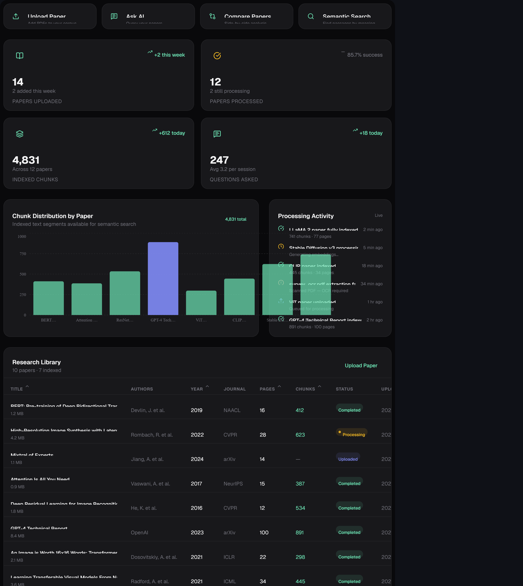
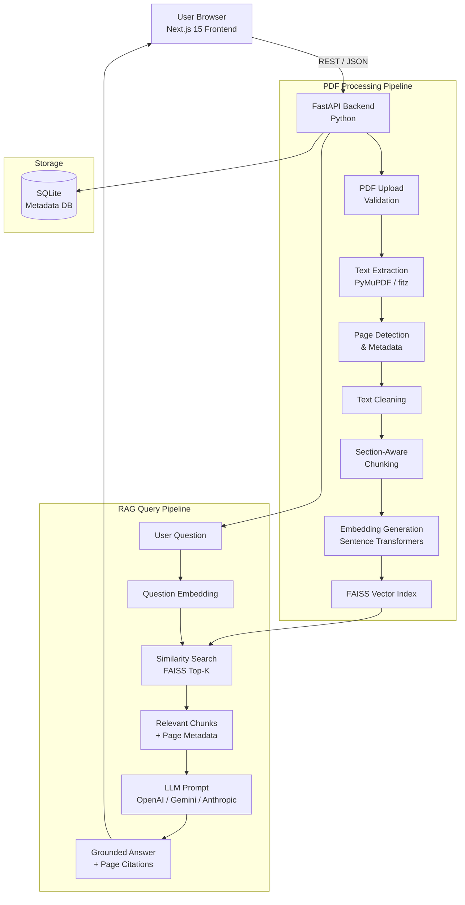

# ResearchPaperAI

> **AI-powered research paper analysis and Retrieval-Augmented Generation (RAG) platform for researchers and students.**

[](https://nextjs.org/)
[](https://www.typescriptlang.org/)
[](https://tailwindcss.com/)
[](https://react.dev/)
[](LICENSE)

---

## Table of Contents

- [Overview](#overview)
- [Features](#features)
- [Technology Stack](#technology-stack)
- [Architecture](#architecture)
- [Project Structure](#project-structure)
- [Installation](#installation)
- [Environment Variable Setup](#environment-variable-setup)
- [Local Development](#local-development)
- [Production Deployment](#production-deployment)
- [GitHub Usage](#github-usage)
- [API Documentation](#api-documentation)
- [RAG Pipeline](#rag-pipeline)
- [AI Safety & Hallucination Control](#ai-safety--hallucination-control)
- [Known Limitations](#known-limitations)
- [Future Work](#future-work)
- [License](#license)

---

## Overview

**ResearchPaperAI** is a production-quality, AI-powered academic research assistant. Researchers and students can upload PDF papers, extract and semantically index their content, and interact with the documents through a Retrieval-Augmented Generation (RAG) chat interface.

Every answer is grounded exclusively in the uploaded documents. The system never fabricates citations, authors, datasets, or numerical results.

---
## 📸 Application Preview

### Research Dashboard


## Features

- 📄 **PDF Upload & Processing** — Single or batch upload with drag-and-drop; validates format, size, and integrity
- 🔍 **Semantic Chunking** — Section-aware chunking (Abstract, Introduction, Methodology, Results, etc.) with page-level metadata
- 🧠 **Embedding Generation** — High-quality embeddings for semantic similarity search
- 🗂️ **Vector Indexing** — FAISS-backed vector store for fast nearest-neighbour retrieval
- 💬 **RAG Chat Interface** — Ask questions; receive answers grounded only in uploaded papers with page-level citations
- 📋 **Structured Paper Summary** — Research problem, methodology, dataset, results, limitations, future work
- 🔬 **Methodology Extractor** — Step-by-step pipeline extraction for ML/AI papers
- 📊 **Dataset & Results Extractor** — Structured tables of datasets and reported metrics
- ⚖️ **Paper Comparison** — Side-by-side comparison table with similarities and differences
- 🔎 **Semantic Search** — Cross-paper search ranked by semantic similarity with filters
- 🕳️ **Research Gap Explorer** — Identifies potential gaps from the uploaded literature
- 📚 **Literature Review Assistant** — Thematic, chronological, and methodology groupings
- 🏷️ **Citation Generator** — APA, IEEE, and Harvard formats from detected metadata
- 📝 **Research Notes** — Annotate papers at page/paragraph level
- 📤 **Export** — Summary as PDF/DOCX, comparison as CSV, bibliography as BibTeX
- 📈 **Research Insights Dashboard** — KPI metrics, chunk distribution chart, activity feed
- 🛡️ **AI Safety** — Strict grounding; explicit "not found" responses when information is unavailable

---

## Technology Stack

| Layer | Technology |
|---|---|
| **Frontend Framework** | Next.js 15 (App Router) |
| **Language** | TypeScript 5 |
| **Styling** | Tailwind CSS 3 |
| **UI Components** | React 19, Heroicons, Lucide React |
| **Charts** | Recharts |
| **Notifications** | Sonner |
| **AI / LLM** | OpenAI API (configurable), Gemini, Anthropic, Perplexity |
| **PDF Processing** | PyMuPDF / fitz (backend) |
| **Embeddings** | Sentence Transformers (backend) |
| **Vector Database** | FAISS (backend) |
| **Metadata Database** | SQLite (backend) |
| **Backend Framework** | FastAPI + Uvicorn (Python) |
| **Analytics** | Google Analytics 4 |
| **Payments** | Stripe (optional) |
| **Auth / DB (optional)** | Supabase |

---

## Architecture



### Key Design Decisions

- **Grounding-first**: The LLM is only given retrieved chunks as context — it cannot draw on general knowledge for document-specific questions.
- **Section-aware chunking**: Headings are detected to keep semantically coherent chunks together.
- **Provider abstraction**: The LLM provider is swappable via environment variables; the same RAG pipeline works with OpenAI, Gemini, Anthropic, or any OpenAI-compatible endpoint.
- **Modular backend**: PDF, embedding, vector, and RAG layers are separate Python modules.

---

## Project Structure

```
researchpaperai/
│
├── public/
│   ├── assets/images/          # Static images (logo, placeholders)
│   └── favicon.ico
│
├── src/
│   ├── app/                    # Next.js App Router
│   │   ├── page.tsx            # Dashboard (home)
│   │   ├── layout.tsx          # Root layout
│   │   ├── not-found.tsx       # 404 page
│   │   ├── components/         # Dashboard-specific components
│   │   │   ├── DashboardMetrics.tsx
│   │   │   ├── DashboardQuickActions.tsx
│   │   │   ├── RecentPapersTable.tsx
│   │   │   ├── ChunkDistributionChart.tsx
│   │   │   └── CorpusActivityFeed.tsx
│   │   ├── ask-research-paper-ai/
│   │   │   ├── page.tsx        # RAG chat interface
│   │   │   └── components/
│   │   │       ├── ChatInterface.tsx
│   │   │       ├── ChatMessage.tsx
│   │   │       ├── PaperSelector.tsx
│   │   │       └── SuggestedQuestions.tsx
│   │   └── upload-paper/
│   │       ├── page.tsx        # PDF upload & processing
│   │       └── components/
│   │           ├── UploadZone.tsx
│   │           ├── UploadQueue.tsx
│   │           ├── PipelineGuide.tsx
│   │           └── MetadataPreview.tsx
│   │
│   ├── components/             # Shared layout components
│   │   ├── AppLayout.tsx
│   │   ├── Sidebar.tsx
│   │   ├── Topbar.tsx
│   │   ├── TopbarActions.tsx
│   │   └── ui/                 # Reusable UI primitives
│   │       ├── AppImage.tsx
│   │       ├── AppIcon.tsx
│   │       ├── AppLogo.tsx
│   │       ├── EmptyState.tsx
│   │       ├── LoadingSkeleton.tsx
│   │       ├── MetricCard.tsx
│   │       └── StatusBadge.tsx
│   │
│   └── styles/
│       ├── index.css           # Global base styles
│       └── tailwind.css        # Tailwind directives & custom tokens
│
├── .env.example                # Environment variable template (no secrets)
├── .eslintrc.json              # ESLint configuration
├── .gitignore                  # Git ignore rules
├── .prettierrc                 # Prettier configuration
├── image-hosts.config.mjs      # Allowed image hosts for next/image
├── next.config.mjs             # Next.js configuration
├── next-env.d.ts               # Next.js TypeScript declarations
├── package.json                # Dependencies & scripts
├── package-lock.json           # Locked dependency tree
├── postcss.config.js           # PostCSS configuration
├── tailwind.config.js          # Tailwind CSS configuration
└── tsconfig.json               # TypeScript configuration
```

---

## Installation

### Prerequisites

| Requirement | Version |
|---|---|
| Node.js | ≥ 18.x |
| npm | ≥ 9.x |
| Git | any recent version |

### 1. Clone the Repository

```bash
git clone https://github.com/your-username/researchpaperai.git
cd researchpaperai
```

### 2. Install Dependencies

```bash
npm install
```

### 3. Configure Environment Variables

```bash
cp .env.example .env.local
```

Open `.env.local` and fill in the required values (see [Environment Variable Setup](#environment-variable-setup)).

### 4. Start the Development Server

```bash
npm run dev
```

The application will be available at **http://localhost:4028**.

---

## Environment Variable Setup

Copy `.env.example` to `.env.local` and provide values for the variables you need.

```bash
cp .env.example .env.local
```

| Variable | Required | Description |
|---|---|---|
| `OPENAI_API_KEY` | ✅ For RAG | OpenAI API key for LLM generation |
| `GEMINI_API_KEY` | Optional | Google Gemini API key (alternative LLM) |
| `ANTHROPIC_API_KEY` | Optional | Anthropic Claude API key (alternative LLM) |
| `PERPLEXITY_API_KEY` | Optional | Perplexity API key (alternative LLM) |
| `NEXT_PUBLIC_SUPABASE_URL` | Optional | Supabase project URL (auth/database) |
| `NEXT_PUBLIC_SUPABASE_ANON_KEY` | Optional | Supabase anonymous key |
| `NEXT_PUBLIC_GA_MEASUREMENT_ID` | Optional | Google Analytics 4 Measurement ID |
| `NEXT_PUBLIC_ADSENSE_ID` | Optional | Google AdSense publisher ID |
| `NEXT_PUBLIC_STRIPE_PUBLISHABLE_KEY` | Optional | Stripe publishable key (payments) |
| `NEXT_PUBLIC_SITE_URL` | Optional | Canonical site URL for SEO/OAuth redirects |

> ⚠️ **Never commit `.env.local` or any file containing real API keys to version control.**

---

## Local Development

```bash
# Start development server (hot reload on port 4028)
npm run dev

# Type-check without emitting files
npm run type-check

# Lint the codebase
npm run lint

# Auto-fix lint issues
npm run lint:fix

# Format code with Prettier
npm run format
```

### Development Server

The dev server runs on **http://localhost:4028** by default (configured in `package.json`).

### Code Quality

- **ESLint** — configured via `.eslintrc.json` with Next.js and TypeScript rules
- **Prettier** — configured via `.prettierrc`
- **TypeScript** — strict mode enabled in `tsconfig.json`

---

## Production Deployment

### Build

```bash
npm run build
```

This generates an optimised production build in `.next/`.

### Start Production Server

```bash
npm run serve
```

### Deploy to Vercel (Recommended)

1. Push your repository to GitHub.
2. Import the project at [vercel.com/new](https://vercel.com/new).
3. Add all environment variables from `.env.example` in the Vercel dashboard.
4. Vercel auto-detects Next.js and deploys on every push to `main`.

### Deploy to Netlify

The project includes `@netlify/plugin-nextjs`. To deploy:

1. Connect your GitHub repository in the Netlify dashboard.
2. Set build command: `npm run build`
3. Set publish directory: `.next`
4. Add environment variables in Netlify's site settings.

### Deploy with Docker

```dockerfile
# Example Dockerfile (add to project root)
FROM node:20-alpine AS builder
WORKDIR /app
COPY package*.json ./
RUN npm ci
COPY . .
RUN npm run build

FROM node:20-alpine AS runner
WORKDIR /app
ENV NODE_ENV=production
COPY --from=builder /app/.next ./.next
COPY --from=builder /app/public ./public
COPY --from=builder /app/package.json ./package.json
RUN npm ci --omit=dev
EXPOSE 3000
CMD ["npm", "run", "serve"]
```

```bash
docker build -t researchpaperai .
docker run -p 3000:3000 --env-file .env.local researchpaperai
```

---

## GitHub Usage

### Initial Push

```bash
git init
git add .
git commit -m "feat: initial ResearchPaperAI commit"
git branch -M main
git remote add origin https://github.com/your-username/researchpaperai.git
git push -u origin main
```

### Branch Strategy

```
main          — stable, production-ready code
develop       — integration branch
feature/*     — individual feature branches
fix/*         — bug fix branches
```

### Pull Request Checklist

- [ ] `npm run type-check` passes
- [ ] `npm run lint` passes
- [ ] `npm run build` succeeds
- [ ] No secrets or API keys committed
- [ ] `.env.example` updated if new variables added

---

## API Documentation

The frontend communicates with a FastAPI backend. Core endpoints:

| Method | Endpoint | Description |
|---|---|---|
| `GET` | `/api/health` | Health check |
| `POST` | `/api/papers/upload` | Upload one or more PDF files |
| `GET` | `/api/papers` | List all uploaded papers |
| `GET` | `/api/papers/{id}` | Get paper details |
| `DELETE` | `/api/papers/{id}` | Delete a paper |
| `POST` | `/api/papers/{id}/summarize` | Generate structured summary |
| `POST` | `/api/chat` | RAG question answering |
| `POST` | `/api/search` | Semantic search across papers |
| `POST` | `/api/compare` | Compare two or more papers |
| `POST` | `/api/extract/methodology` | Extract methodology pipeline |
| `POST` | `/api/extract/dataset` | Extract dataset information |
| `POST` | `/api/extract/results` | Extract reported metrics |

---

## RAG Pipeline

```
User Question
     │
     ▼
Question Embedding (Sentence Transformers)
     │
     ▼
FAISS Similarity Search → Top-K Chunks
     │
     ▼
Chunk Metadata (document_id, page, section, chunk_id)
     │
     ▼
LLM Prompt Construction
  ┌─────────────────────────────────────────┐
  │ System: Answer ONLY from the provided   │
  │ context. If not found, say so.          │
  │ Context: [retrieved chunks]             │
  │ Question: [user question]               │
  └─────────────────────────────────────────┘
     │
     ▼
Grounded Answer + Page Citations
```

Each answer includes:
- The answer text
- Source references: `Paper Title — Page N`
- The retrieved passage highlighted

---

## AI Safety & Hallucination Control

ResearchPaperAI enforces strict grounding:

- ✅ Answers are generated **only** from retrieved document chunks
- ✅ If information is not found: *"I could not find sufficient information about this in the uploaded papers."*
- ✅ Metadata (authors, DOI, year) is extracted — never invented
- ✅ Missing metadata is displayed as *"Not detected"*
- ✅ Research gaps are labelled as *"Potential gap suggested by the uploaded literature"*
- ❌ No fabricated citations, datasets, or numerical results

---

## Known Limitations

- OCR for scanned PDFs requires an additional OCR backend (e.g., Tesseract)
- Very large PDFs (>200 pages) may have slower processing times
- Metadata extraction accuracy depends on PDF formatting quality
- The frontend currently uses simulated/mock API responses; a live FastAPI backend is required for full RAG functionality
- Multi-language paper support is limited to English in the initial version

---

## Future Work

- [ ] Full FastAPI backend with PyMuPDF, Sentence Transformers, and FAISS
- [ ] OCR fallback for scanned PDFs (Tesseract integration)
- [ ] Chroma / Pinecone vector database support
- [ ] Multi-user authentication and paper libraries
- [ ] Real-time processing progress via WebSockets
- [ ] PDF viewer with in-page citation highlighting
- [ ] Export to PDF/DOCX/BibTeX
- [ ] Multi-language support
- [ ] Fine-tuned embedding model for academic text
- [ ] Collaborative research notes

---

## License

This project is licensed under the **MIT License**.

```
MIT License

Copyright (c) 2024 ResearchPaperAI Contributors

Permission is hereby granted, free of charge, to any person obtaining a copy
of this software and associated documentation files (the "Software"), to deal
in the Software without restriction, including without limitation the rights
to use, copy, modify, merge, publish, distribute, sublicense, and/or sell
copies of the Software, and to permit persons to whom the Software is
furnished to do so, subject to the following conditions:

The above copyright notice and this permission notice shall be included in all
copies or substantial portions of the Software.

THE SOFTWARE IS PROVIDED "AS IS", WITHOUT WARRANTY OF ANY KIND, EXPRESS OR
IMPLIED, INCLUDING BUT NOT LIMITED TO THE WARRANTIES OF MERCHANTABILITY,
FITNESS FOR A PARTICULAR PURPOSE AND NONINFRINGEMENT. IN NO EVENT SHALL THE
AUTHORS OR COPYRIGHT HOLDERS BE LIABLE FOR ANY CLAIM, DAMAGES OR OTHER
LIABILITY, WHETHER IN AN ACTION OF CONTRACT, TORT OR OTHERWISE, ARISING FROM,
OUT OF OR IN CONNECTION WITH THE SOFTWARE OR THE USE OR OTHER DEALINGS IN THE
SOFTWARE.
```

---

*Built with ❤️ for the research community.*
